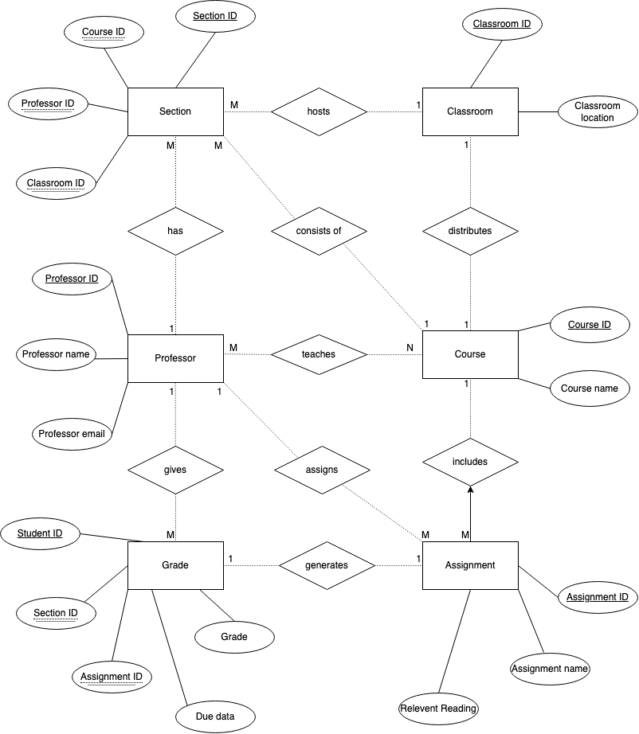

# Data Normalization and Entity-Relationship Diagramming

## Original data set
| assignment_id | student_id | due_date | professor | assignment_topic                | classroom | grade | relevant_reading    | professor_email   |
| :------------ | :--------- | :------- | :-------- | :------------------------------ | :-------- | :---- | :------------------ | :---------------- |
| 1             | 1          | 23.02.21 | Melvin    | Data normalization              | WWH 101   | 80    | Deumlich Chapter 3  | l.melvin@foo.edu  |
| 2             | 7          | 18.11.21 | Logston   | Single table queries            | 60FA 314  | 25    | Dümmlers Chapter 11 | e.logston@foo.edu |
| 1             | 4          | 23.02.21 | Melvin    | Data normalization              | WWH 101   | 75    | Deumlich Chapter 3  | l.melvin@foo.edu  |
| 5             | 2          | 05.05.21 | Logston   | Python and pandas               | 60FA 314  | 92    | Dümmlers Chapter 14 | e.logston@foo.edu |
| 4             | 2          | 04.07.21 | Nevarez   | Spreadsheet aggregate functions | WWH 201   | 65    | Zehnder Page 87     | i.nevarez@foo.edu |
| ...           | ...        | ...      | ...       | ...                             | ...       | ...   | ...                 | ...               |

### Non-compliance with 4NF

The original dataset contained various forms of redundancy, transitive dependencies, and multi-valued dependencies, which are not permitted in 4NF.

- The `professor` and `professor_email` fields are dependent on each other but not on the primary key (composite key of `assignment_id`, `student_id`, and `due_date`).
- The `assignment_topic` and `relevant_reading` are dependent on `assignment_id` but not on the whole primary key.
- Classrooms are tied to specific courses and professors, suggesting an improper storage of multi-valued facts.

## Changes Made for 4NF Compliance

To achieve 4NF compliance, we restructured the data into multiple tables, each focusing on a single theme. This involved the creation of additional fields and tables, as necessary, to eliminate multi-valued dependencies. Below are the redesigned tables:

## Achieving 4NF Compliance

To make the dataset 4NF compliant, we undertook the following steps, creating separate tables for different entities to eliminate multi-valued and transitive dependencies:

### 1. Professors Table

| professor_id | professor_name | professor_email      |
|--------------|----------------|----------------------|
| 1            | Melvin         | l.melvin@foo.edu     |
| 2            | Logston        | e.logston@foo.edu    |
| 3            | Nevarez        | i.nevarez@foo.edu    |
| ...          | ...            | ...                  |

### 2. Assignments Table

| assignment_id | assignment_topic                 | relevant_reading    |
|---------------|----------------------------------|---------------------|
| 1             | Data normalization               | Deumlich Chapter 3  |
| 2             | Single table queries             | Dümmlers Chapter 11 |
| 5             | Python and pandas                | Dümmlers Chapter 14 |
| 4             | Spreadsheet aggregate functions  | Zehnder Page 87     |
| ...           | ...                              | ...                 |

### 3. Courses Table

| course_id | course_name    |
|-----------|----------------|
| 101       | Data Science   |
| 102       | Database Systems |
| ...       | ...              |

### 4. Classrooms Table

Organizes classroom information to manage physical locations independently of the courses or sections.

| classroom_id | classroom_location |
|--------------|--------------------|
| 1            | WWH 101            |
| 2            | 60FA 314           |
| 3            | WWH 201            |

### 5. Sections Table

Connects courses, professors, and classrooms, addressing the issue of sections of the same course possibly meeting in different classrooms or being taught by different professors.

| section_id | course_id | professor_id | classroom_id |
|------------|-----------|--------------|--------------|
| 1          | 101       | 1            | 1            |
| 2          | 102       | 2            | 2            |
| 3          | 102       | 3            | 3            |

### 6. Grades Table

Stores grades, linking them to students, assignments, and the sections where the assignment was given, eliminating the multi-valued dependencies seen in the original dataset.

| student_id | section_id | assignment_id | grade | due_date  |
|------------|------------|---------------|-------|-----------|
| 1          | 1          | 1             | 80    | 23.02.21  |
| 7          | 2          | 2             | 25    | 18.11.21  |
| 4          | 1          | 1             | 75    | 23.02.21  |
| 2          | 2          | 5             | 92    | 05.05.21  |
| 2          | 3          | 4             | 65    | 04.07.21  |

## The ER diagram of 4NF-compliant version of the data set

## Changes the data 4NF-compliant

### Create distinctive table
I divide the dataset into six distinct tables: Professors, Assignments, Courses, Classrooms, Sections, and Grades. By thinking logically, I made sure that each table represented a unique aspect of the university's grade in course structure.

### Normalization and adding additional fields

